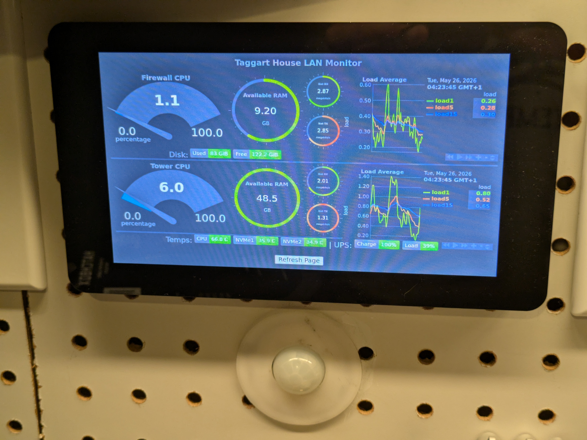
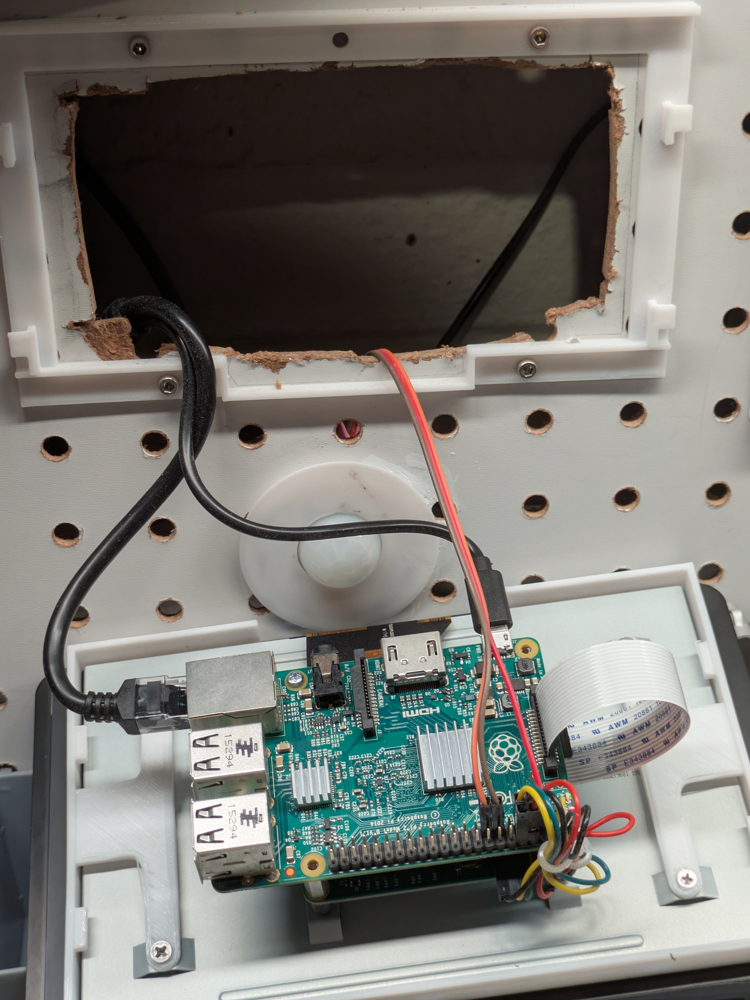
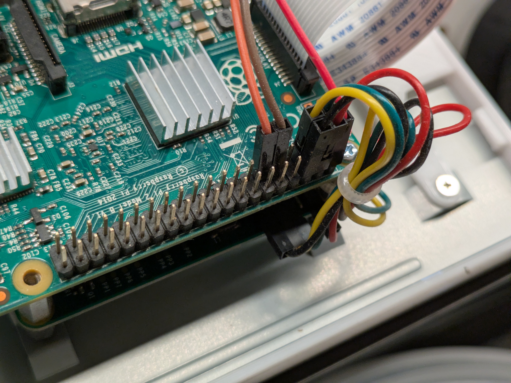

# MonitorPI

Motion-activated Raspberry Pi kiosk for a wall-mounted web dashboard.

This kiosk was built for a **7" Raspberry Pi touch display** showing a **custom [Netdata](https://www.netdata.cloud/) dashboard** sized for the screen. Point `KIOSK_URL` at any full-page URL; the motion sensor only controls display power, not the browser session.

## Photos

*Photos coming — add `finished.jpg`, `installed-back.jpg`, and `wiring.jpg` under [docs/images](docs/images/).*

| | |
|---|---|
| Finished (front) | `docs/images/finished.jpg` |
| Installed (back) | `docs/images/installed-back.jpg` |
| Wiring | `docs/images/wiring.jpg` |

When the images are in place, they will appear here:

<!--



-->

## How it works

1. On boot, a **systemd user service** runs `kiosk.sh`.
2. `kiosk.sh` hides the cursor (`unclutter`), starts the motion script, and launches **Chromium in kiosk mode** to your URL.
3. `motion-sensor-screen.py` watches a **PIR sensor** on GPIO 17. Motion turns the display on via `xset dpms`; after idle time with no motion, the display turns off. Chromium keeps running in the background.

## Hardware

- Raspberry Pi with Raspberry Pi OS (desktop)
- 7" touch display (or any HDMI display)
- PIR motion sensor on **BCM GPIO 17** (default; configurable)

See [docs/images](docs/images/) for wiring photos when available.

## Software prerequisites

On the Pi:

```bash
sudo apt update
sudo apt install -y chromium unclutter x11-xserver-utils python3 python3-rpi.gpio
```

On older Raspberry Pi OS images the browser package may be named `chromium-browser` instead of `chromium`. The kiosk script tries both.

Optional: install Python dependencies with pip:

```bash
pip install -r requirements.txt
```

## Configuration

```bash
cp config.example.env config.env
```

Edit `config.env`:

| Variable | Description |
|----------|-------------|
| `KIOSK_URL` | Full URL for Chromium kiosk mode (e.g. your Netdata dashboard) |
| `DISPLAY` | X display (usually `:0`) |
| `PIR_GPIO` | BCM GPIO pin for PIR output (default `17`) |
| `IDLE_SECONDS` | Turn display off after this many seconds without motion |
| `POLL_SECONDS` | How often to read the PIR (default `5`) |
| `CHROMIUM_PREFS` | Path to Chromium `Preferences` file for crash-banner cleanup |

`config.env` is gitignored — do not commit it.

## Installation

1. Clone this repo on the Pi, for example:

   ```bash
   git clone https://github.com/sebastientaggart/MonitorPI.git /home/pi/MonitorPI
   cd /home/pi/MonitorPI
   ```

2. Create and edit `config.env` as above.

3. Make the launcher executable:

   ```bash
   chmod +x kiosk.sh motion-sensor-screen.py
   ```

4. Install the systemd user service:

   ```bash
   mkdir -p ~/.config/systemd/user
   cp systemd/monitorpi-kiosk.service.example ~/.config/systemd/user/monitorpi-kiosk.service
   ```

   Edit `~/.config/systemd/user/monitorpi-kiosk.service` if your install path is not `/home/pi/MonitorPI`.

5. Enable and start:

   ```bash
   systemctl --user daemon-reload
   systemctl --user enable --now monitorpi-kiosk.service
   ```

6. If the kiosk should start at boot without an interactive login:

   ```bash
   sudo loginctl enable-linger pi
   ```

## Netdata dashboards

The dashboard HTML is served by Netdata (or your own server), not by this repo. MonitorPI only opens a URL in Chromium. To build a dashboard that fits a small screen, see the [Netdata documentation](https://learn.netdata.cloud/docs).

## Troubleshooting

| Problem | Things to check |
|---------|------------------|
| Display stays off | PIR wiring and GPIO pin in `config.env`; run `motion-sensor-screen.py` manually and watch for `xset` errors |
| Chromium “didn’t shut down correctly” bar | `CHROMIUM_PREFS` path; `kiosk.sh` patches prefs on start if the file exists |
| Blank or wrong page | `KIOSK_URL` reachable from the Pi (`curl` the URL) |
| Nothing on screen | `DISPLAY=:0`; desktop session running; service logs: `journalctl --user -u monitorpi-kiosk.service -f` |
| Restart kiosk | `systemctl --user restart monitorpi-kiosk.service` |

Useful manual commands (also in comments at the bottom of `kiosk.sh`):

```bash
DISPLAY=:0 xset dpms force on
DISPLAY=:0 xset dpms force off
pkill -o chromium
```

## License

[MIT License](LICENSE)
